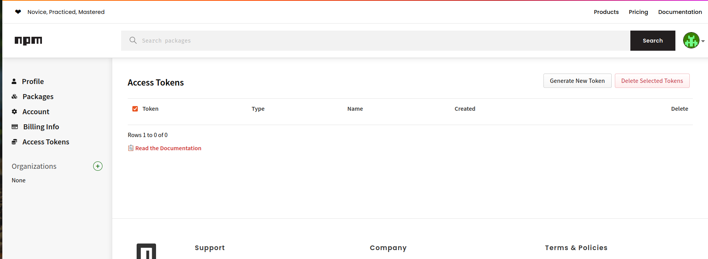

# Postwork

### Requisitos

* Tener Node instalado.

### Objetivo

* Entender los usos de npm y por qué publicar módulos 

# Sesión 01

  ## Publicar un módulo en NPM

  Para publicar un módulo en NPM es necesario una cuenta y que puedes crear desde el [link](https://www.npmjs.com/signup) el siguiente artículo puede ser una guía similar a lo que se hizo en la sesión (configurar package.json y preparar tu código) y además de ello los pasos para publicar un módulo en el repositorio.

  - 

  También, es importante mantener un módulo actualizado para mantenerlo estable y resolver los issues reportados por los usuarios, este articulo hace mención de cómo subir versiones nuevas.

  ## Automatizar subida de versiones en NPM

  El siguiente [post](https://medium.com/@muzk/cómo-automatizar-la-subida-de-versiones-) aborda dos maneras de cómo automatizar las subidas de versiones, de esta manera cada que se necesite lanzar una nueva versión se hará de una manera rápida y optimiza.
